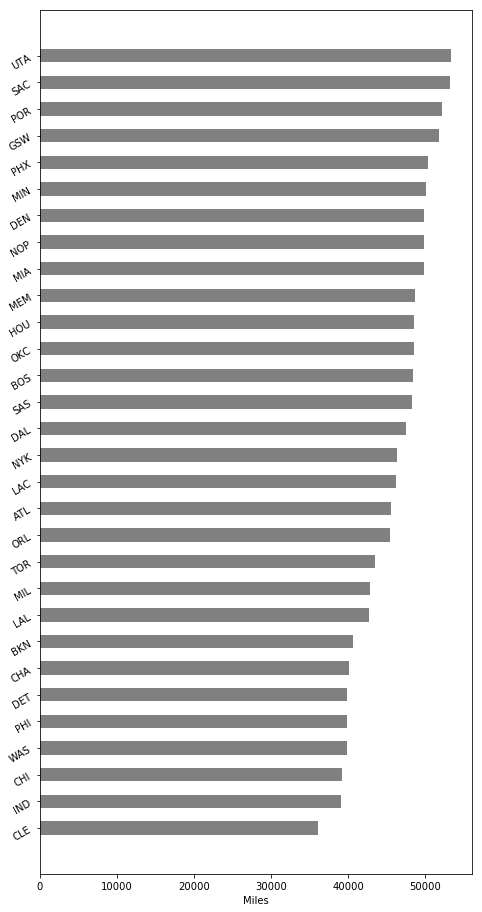
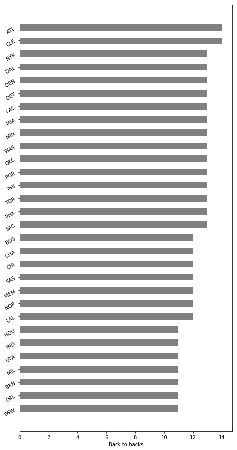

# team_travel
Visualizing and quantifying NBA team travel

## Description

This repo contains a notebook (`team_travel.ipynb`) using the `scoreboardv2` endpoint of the [stats.nba.com](https://stats.nba.com) API. With the `Scoreboard` classe from the `py_ball` package, the code here explores the miles traveled and back-to-back games for the 2019-2020 NBA regular season.

## Results

### Travel

The figure below shows the miles traveled by team.

Utah leads the league in miles traveled, which is no surprise given their division, conference and location. They travel more than 17,000 more miles than the last team in the league, Cleveland.

### Back-to-backs

The figure below shows the number of back-to-backs by team.

The number of back-to-backs across teams is rather tight, with the lowest number being 11 and the highest number being 14. The NBA has made an effort to ensure the balance of back-to-backs across teams.
